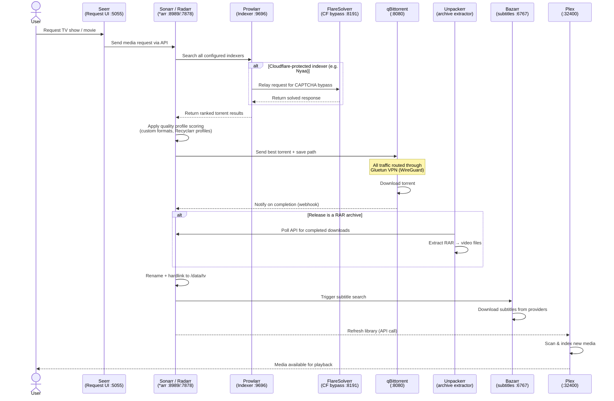
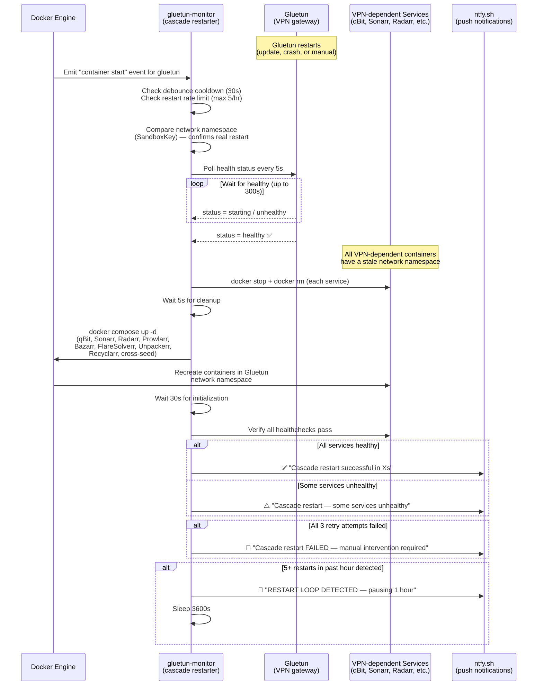
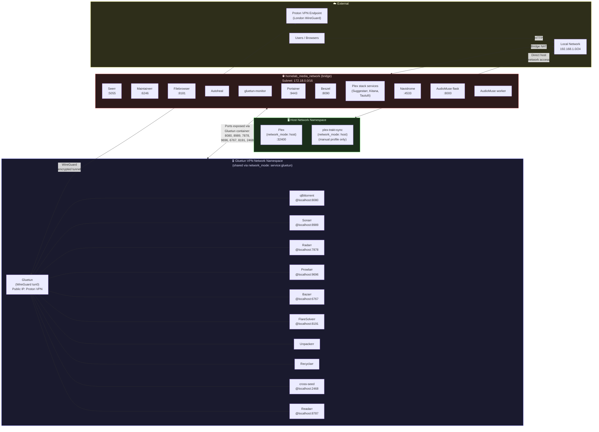
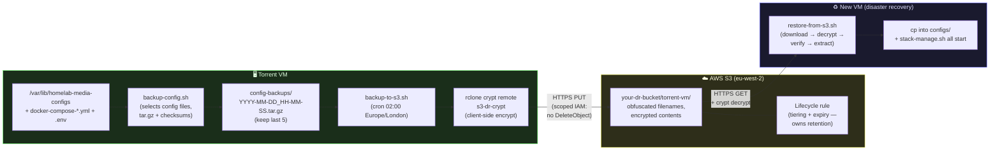

# Architecture Diagrams

## 1. Main System Overview

All services, stacks, networks, and their connections at a glance.

```mermaid
graph TB
    subgraph INTERNET["☁️ Internet"]
        TRACKERS["Torrent Trackers"]
        INDEXERS["Indexers (Nyaa, etc.)"]
        PROV["Proton VPN\n(WireGuard)"]
        NTFY["ntfy.sh\n(Push Notifications)"]
    end

    subgraph HOST["🖥️ Host Machine (homelab server)"]
        subgraph TORRENT_STACK["📦 Torrent Stack  (homelab-torrent)"]
            subgraph VPN_NS["🔒 Gluetun VPN Namespace"]
                GLUETUN["Gluetun\n(WireGuard gateway)\n:8080/:8989/:7878\n/:9696/:6767/:8191/:2468"]
                QB["qBittorrent\n:8080"]
                SONARR["Sonarr\n:8989"]
                RADARR["Radarr\n:7878"]
                PROWLARR["Prowlarr\n:9696"]
                BAZARR["Bazarr\n:6767"]
                FLARE["FlareSolverr\n:8191"]
                UNPACKERR["Unpackerr"]
                RECYCLARR["Recyclarr"]
                CROSSSEED["cross-seed\n:2468"]
                READARR["Readarr\n:8787"]
            end
            CLEANUPARR["Cleanuparr\n:11011 (bridge)"]
            WHISPER["Whisper ASR\n:9000 (bridge)"]
        end

        subgraph PLEX_STACK["📺 Plex Stack  (homelab-plex)"]
            PLEX["Plex\n(host network)\n:32400"]
            SUGGESTARR["SuggestArr\n:5000"]
            KITANA["Kitana\n:31337"]
            TAUTULLI["Tautulli\n:8787"]
        end

        subgraph SERVICES_STACK["⚙️ Services Stack  (homelab-services)"]
            SEERR["Seerr\n:5055"]
            MAINTAINERR["Maintainerr\n:6246"]
            FILEBROWSER["Filebrowser\n:8181"]
            PICARD["Picard\n:5800"]
            AUTOHEAL["Autoheal\n(watchdog)"]
            GLUETUN_MON["gluetun-monitor\n(cascade restarter)"]
            PORTAINER["Portainer\n:9443"]
            BESZEL["Beszel\n:8090"]
        end

        subgraph MUSIC_STACK["🎵 Music Stack  (homelab-music)"]
            NAVIDROME["Navidrome\n:4533"]
            AM_FLASK["AudioMuse flask\n:8000"]
            AM_WORKER["AudioMuse worker"]
            AM_REDIS["Redis\n(task queue)"]
            AM_PG["Postgres\n(database)"]
            AM_FLASK & AM_WORKER -->|"reads library"| NAVIDROME
            AM_REDIS & AM_PG --- AM_FLASK & AM_WORKER
        end

        subgraph LOGGING["🪵 Logging Stack"]
            LK["Loki"]
            PT["Promtail"]
            GF["Grafana"]
            AM["Alertmanager"]
            NB["ntfy-bridge"]
            PT --> LK --> GF
            LK --> AM --> NB
        end

        subgraph SHARED_NET["🌐 homelab_media_network (bridge)"]
        end

        subgraph STORAGE["💾 Storage"]
            MEDIA["/mnt/media\n(movies, tv, downloads)"]
            CONFIGS["/var/lib/homelab-media-configs\n(all app configs)"]
        end

        DOCKER_SOCK["/var/run/docker.sock"]
    end

    %% Internet connections
    GLUETUN <-->|"WireGuard tunnel"| PROV
    QB -->|"all torrent traffic\nvia VPN"| TRACKERS
    PROWLARR -->|"all indexer traffic\nvia VPN"| INDEXERS
    GLUETUN_MON -->|"push alerts"| NTFY

    %% VPN namespace internal (localhost)
    GLUETUN --- QB & SONARR & RADARR & PROWLARR & BAZARR & FLARE & UNPACKERR & RECYCLARR & CROSSSEED & READARR

    %% Automation connections (localhost within VPN namespace)
    PROWLARR -->|"RSS/search"| SONARR & RADARR
    FLARE -->|"CF bypass"| PROWLARR
    SONARR & RADARR -->|"grab torrents"| QB
    UNPACKERR -->|"poll API"| SONARR & RADARR
    RECYCLARR -->|"sync profiles"| SONARR & RADARR
    CROSSSEED -->|"match torrents"| QB
    CLEANUPARR -->|"clean queues + block malware\n(via gluetun ports)"| QB & SONARR & RADARR
    BAZARR -->|"AI subtitles\n(via host IP)"| WHISPER

    %% Cross-stack connections
    SEERR -->|"requests"| SONARR & RADARR
    SONARR & RADARR -->|"notify on import"| BAZARR
    PLEX -->|"library"| MEDIA
    SUGGESTARR -->|"recommendations"| SEERR
    TAUTULLI -->|"play stats"| PLEX
    KITANA -->|"plugin mgmt"| PLEX
    MAINTAINERR -->|"cleanup rules"| PLEX & SEERR

    %% Self-healing & monitoring
    AUTOHEAL -->|"restart unhealthy\ncontainers"| DOCKER_SOCK
    GLUETUN_MON -->|"watch events"| DOCKER_SOCK

    %% Storage
    QB & SONARR & RADARR & BAZARR & UNPACKERR --> MEDIA
    PLEX --> MEDIA
    NAVIDROME -->|"reads music\n(read-only)"| MEDIA
    SERVICES_STACK -.-> CONFIGS
    PT -->|"scrapes all containers"| LK

    %% Network membership
    TORRENT_STACK -.-> SHARED_NET
    PLEX_STACK -.-> SHARED_NET
    SERVICES_STACK -.-> SHARED_NET
    MUSIC_STACK -.-> SHARED_NET
    BOOKS_STACK -.-> SHARED_NET
```

---

## 2. Media Request Flow

End-to-end journey from a user requesting media to it appearing in Plex.

```mermaid
sequenceDiagram
    actor User
    participant Seerr as Seerr<br/>(Request UI :5055)
    participant Sonarr as Sonarr / Radarr<br/>(*arr :8989/:7878)
    participant Prowlarr as Prowlarr<br/>(Indexer :9696)
    participant FlareSolverr as FlareSolverr<br/>(CF bypass :8191)
    participant qBit as qBittorrent<br/>(:8080)
    participant Unpackerr as Unpackerr<br/>(archive extractor)
    participant Bazarr as Bazarr<br/>(subtitles :6767)
    participant Plex as Plex<br/>(:32400)

    User->>Seerr: Request TV show / movie
    Seerr->>Sonarr: Send media request via API
    Sonarr->>Prowlarr: Search all configured indexers
    alt Cloudflare-protected indexer (e.g. Nyaa)
        Prowlarr->>FlareSolverr: Relay request for CAPTCHA bypass
        FlareSolverr-->>Prowlarr: Return solved response
    end
    Prowlarr-->>Sonarr: Return ranked torrent results
    Sonarr->>Sonarr: Apply quality profile scoring<br/>(custom formats, Recyclarr profiles)
    Sonarr->>qBit: Send best torrent + save path
    Note over qBit: All traffic routed through<br/>Gluetun VPN (WireGuard)
    qBit->>qBit: Download torrent
    qBit-->>Sonarr: Notify on completion (webhook)
    alt Release is a RAR archive
        Unpackerr->>Sonarr: Poll API for completed downloads
        Unpackerr->>Unpackerr: Extract RAR → video files
    end
    Sonarr->>Sonarr: Rename + hardlink to /data/tv
    Sonarr->>Bazarr: Trigger subtitle search
    Bazarr->>Bazarr: Download subtitles from providers
    Sonarr-->>Plex: Refresh library (API call)
    Plex->>Plex: Scan & index new media
    Plex-->>User: Media available for playback
```

---

## 3. VPN Auto-Healing Flow

How the system detects and recovers from a Gluetun VPN restart without manual intervention.

```mermaid
sequenceDiagram
    participant Docker as Docker Engine
    participant Monitor as gluetun-monitor<br/>(cascade restarter)
    participant Gluetun as Gluetun<br/>(VPN gateway)
    participant Services as VPN-dependent Services<br/>(qBit, Sonarr, Radarr, etc.)
    participant Ntfy as ntfy.sh<br/>(push notifications)

    Note over Gluetun: Gluetun restarts<br/>(update, crash, or manual)
    Docker->>Monitor: Emit "container start" event for gluetun

    Monitor->>Monitor: Check debounce cooldown (30s)<br/>Check restart rate limit (max 5/hr)
    Monitor->>Monitor: Compare network namespace<br/>(SandboxKey) — confirms real restart

    Monitor->>Gluetun: Poll health status every 5s
    loop Wait for healthy (up to 300s)
        Gluetun-->>Monitor: status = starting / unhealthy
    end
    Gluetun-->>Monitor: status = healthy ✅

    Note over Services: All VPN-dependent containers<br/>have a stale network namespace
    Monitor->>Services: docker stop + docker rm (each service)
    Monitor->>Monitor: Wait 5s for cleanup

    Monitor->>Docker: docker compose up -d<br/>(qBit, Sonarr, Radarr, Prowlarr,<br/>Bazarr, FlareSolverr, Unpackerr,<br/>Recyclarr, cross-seed)
    Docker->>Services: Recreate containers in Gluetun<br/>network namespace

    Monitor->>Monitor: Wait 30s for initialization
    Monitor->>Services: Verify all healthchecks pass

    alt All services healthy
        Monitor->>Ntfy: ✅ "Cascade restart successful in Xs"
    else Some services unhealthy
        Monitor->>Ntfy: ⚠️ "Cascade restart — some services unhealthy"
    end

    alt All 3 retry attempts failed
        Monitor->>Ntfy: 🚨 "Cascade restart FAILED — manual intervention required"
    end

    alt 5+ restarts in past hour detected
        Monitor->>Ntfy: 🚨 "RESTART LOOP DETECTED — pausing 1 hour"
        Monitor->>Monitor: Sleep 3600s
    end
```

---

## 4. Network Topology

How containers are arranged across three distinct network boundaries.

```mermaid
graph LR
    subgraph HOST["🖥️ Host Network Namespace"]
        PLEX_HOST["Plex\n(network_mode: host)\n:32400"]
        PTS["plex-trakt-sync\n(network_mode: host)\n(manual profile only)"]
    end

    subgraph VPN_NS["🔒 Gluetun VPN Network Namespace\n(shared via network_mode: service:gluetun)"]
        direction TB
        GL["Gluetun\n(WireGuard tun0)\nPublic IP: Proton VPN"]
        QB2["qBittorrent\n@localhost:8080"]
        SN["Sonarr\n@localhost:8989"]
        RD["Radarr\n@localhost:7878"]
        PW["Prowlarr\n@localhost:9696"]
        BZ["Bazarr\n@localhost:6767"]
        FS["FlareSolverr\n@localhost:8191"]
        UN["Unpackerr"]
        RC["Recyclarr"]
        CS["cross-seed\n@localhost:2468"]
        RA["Readarr\n@localhost:8787"]
        GL --- QB2 & SN & RD & PW & BZ & FS & UN & RC & CS & RA
    end

    subgraph BRIDGE["🌐 homelab_media_network (bridge)\nSubnet: 172.18.0.0/16"]
        direction TB
        SEERR2["Seerr\n:5055"]
        MAINT["Maintainerr\n:6246"]
        FB["Filebrowser\n:8181"]
        AH["Autoheal"]
        GM["gluetun-monitor"]
        PORT["Portainer\n:9443"]
        BSZ["Beszel\n:8090"]
        PLEX2["Plex stack services\n(Suggestarr, Kitana,\nTautulli)"]
        NAV2["Navidrome\n:4533"]
        AMF["AudioMuse flask\n:8000"]
        AMW["AudioMuse worker"]
    end

    subgraph EXTERNAL["☁️ External"]
        VPN_EP["Proton VPN Endpoint\n(London WireGuard)"]
        LAN["Local Network\n192.168.1.0/24"]
        USERS["Users / Browsers"]
    end

    GL <-->|"WireGuard\nencrypted tunnel"| VPN_EP
    VPN_NS <-->|"Ports exposed via\nGluetun container:\n8080, 8989, 7878,\n9696, 6767, 8191, 2468"| BRIDGE
    BRIDGE <-->|"Bridge NAT"| LAN
    HOST <-->|"Direct host\nnetwork access"| LAN
    USERS -->|"HTTP"| LAN

    style VPN_NS fill:#1a1a2e,color:#e0e0ff,stroke:#6060ff
    style HOST fill:#1a2e1a,color:#e0ffe0,stroke:#60ff60
    style BRIDGE fill:#2e1a1a,color:#ffe0e0,stroke:#ff6060
    style EXTERNAL fill:#2e2e1a,color:#ffffe0,stroke:#ffff60
```

**Key network rules enforced by Gluetun firewall:**

| Rule | Detail |
|------|--------|
| Kill switch | `FIREWALL=on` — no traffic leaves if VPN drops |
| Allowed outbound | `FIREWALL_OUTBOUND_SUBNETS=192.168.1.0/24,172.18.0.0/16` (LAN + bridge) |
| DNS | Cloudflare `1.1.1.1` (DoT disabled for compatibility) |
| Port forwarding | `VPN_PORT_FORWARDING=on` — dynamic port assigned by Proton, pushed to qBit via API |
| MTU | `WIREGUARD_MTU=1280` (conservative for tunnel stability) |

## 5. Disaster-Recovery Backup Flow

How config archives get an encrypted, off-host copy in S3 — and how a lost VM is rebuilt from it.

```mermaid
graph LR
    subgraph HOST["🖥️ Torrent VM"]
        CFG["/var/lib/homelab-media-configs\n+ docker-compose-*.yml + .env"]
        BC["backup-config.sh\n(selects config files,\ntar.gz + checksums)"]
        LOCAL["config-backups/\nYYYY-MM-DD_HH-MM-SS.tar.gz\n(keep last 5)"]
        B2S["backup-to-s3.sh\n(cron 02:00 Europe/London)"]
        RC["rclone crypt remote\ns3-dr-crypt\n(client-side encrypt)"]
        CFG --> BC --> LOCAL --> B2S --> RC
    end

    subgraph AWS["☁️ AWS S3 (eu-west-2)"]
        BUCKET["your-dr-bucket/torrent-vm/\nobfuscated filenames,\nencrypted contents"]
        LC["Lifecycle rule\n(tiering + expiry —\nowns retention)"]
        BUCKET --- LC
    end

    RC -->|"HTTPS PUT\n(scoped IAM:\nno DeleteObject)"| BUCKET

    subgraph RECOVER["♻️ New VM (disaster recovery)"]
        RES["restore-from-s3.sh\n(download → decrypt →\nverify → extract)"]
        REHYDRATE["cp into configs/\n+ stack-manage.sh all start"]
        RES --> REHYDRATE
    end

    BUCKET -->|"HTTPS GET\n+ crypt decrypt"| RES

    style HOST fill:#1a2e1a,color:#e0ffe0,stroke:#60ff60
    style AWS fill:#2e2e1a,color:#ffffe0,stroke:#ffff60
    style RECOVER fill:#1a1a2e,color:#e0e0ff,stroke:#6060ff
```

**Recovery-relevant properties:**

| Property | Detail |
|------|--------|
| Encryption | Client-side via rclone `crypt` — filenames and contents encrypted before leaving the host |
| Secret location | AWS keys + crypt password live in `~/.config/rclone/rclone.conf`, never in the repo or the uploaded archive |
| Retention | Owned by the S3 lifecycle rule; the host's IAM key has **no `DeleteObject`** (append-only recovery points) |
| Schedule | Daily 02:00 UK, two hours after the stack-update job (captures post-update state) |
| Single point of failure | The crypt password — store off-VM; losing it makes backups unrecoverable |
