# Architecture Diagrams

## 1. Main System Overview

All services, stacks, networks, and their connections at a glance.

---

## 2. Media Request Flow

End-to-end journey from a user requesting media to it appearing in Plex.

---

## 3. VPN Auto-Healing Flow

How the system detects and recovers from a Gluetun VPN restart without manual intervention.

```mermaid
sequenceDiagram
    participant Docker as Docker Engine
    participant Monitor as gluetun-monitor<br/>(cascade restarter)
    participant Gluetun as Gluetun<br/>(VPN gateway)
    participant Services as VPN-dependent Services<br/>(qBit, Sonarr, Radarr, etc.)
    participant Ntfy as ntfy.sh<br/>(push notifications)

    Note over Gluetun: Gluetun restarts<br/>(update, crash, or manual)
    Docker->>Monitor: Emit "container start" event for gluetun

    Monitor->>Monitor: Check debounce cooldown (30s)<br/>Check restart rate limit (max 5/hr)
    Monitor->>Monitor: Compare network namespace<br/>(SandboxKey) — confirms real restart

    Monitor->>Gluetun: Poll health status every 5s
    loop Wait for healthy (up to 300s)
        Gluetun-->>Monitor: status = starting / unhealthy
    end
    Gluetun-->>Monitor: status = healthy ✅

    Note over Services: All VPN-dependent containers<br/>have a stale network namespace
    Monitor->>Services: docker stop + docker rm (each service)
    Monitor->>Monitor: Wait 5s for cleanup

    Monitor->>Docker: docker compose up -d<br/>(qBit, Sonarr, Radarr, Prowlarr,<br/>Bazarr, FlareSolverr, Unpackerr,<br/>Recyclarr, cross-seed)
    Docker->>Services: Recreate containers in Gluetun<br/>network namespace

    Monitor->>Monitor: Wait 30s for initialization
    Monitor->>Services: Verify all healthchecks pass

    alt All services healthy
        Monitor->>Ntfy: ✅ "Cascade restart successful in Xs"
    else Some services unhealthy
        Monitor->>Ntfy: ⚠️ "Cascade restart — some services unhealthy"
    end

    alt All 3 retry attempts failed
        Monitor->>Ntfy: 🚨 "Cascade restart FAILED — manual intervention required"
    end

    alt 5+ restarts in past hour detected
        Monitor->>Ntfy: 🚨 "RESTART LOOP DETECTED — pausing 1 hour"
        Monitor->>Monitor: Sleep 3600s
    end
```

---

## 4. Container Auto-Update Flow

How What's Up Docker (WUD) detects, notifies, and automatically applies container image updates.

```mermaid
sequenceDiagram
    participant Registry as Container Registry<br/>(ghcr.io, dockerhub, lscr.io)
    participant WUD as What's Up Docker<br/>(:3000)
    participant Ntfy as ntfy.sh<br/>(batch notification)
    participant Webhook as wud-webhook server<br/>(Python :8182)
    participant Handler as wud-update-handler.sh
    participant StackManage as stack-manage.sh
    participant Docker as Docker Engine

    Note over WUD: Daily cron at 06:00
    WUD->>Registry: Check all watched container image tags
    Registry-->>WUD: Return latest digest/tag per image

    WUD->>WUD: Compare with current running tag

    alt Update(s) available
        WUD->>Ntfy: Batch notification:<br/>"N containers have updates available"
        loop For each updated container
            WUD->>Webhook: POST /  with container name, image, new tag
            Webhook->>Webhook: Parse JSON payload<br/>Strip stack prefix from container name
            Webhook->>Handler: Pipe JSON to wud-update-handler.sh (stdin)
            Handler->>Handler: Map container → stack + service name
            Handler->>StackManage: cd /homelab && ./stack-manage.sh <stack> update <service>
            StackManage->>Docker: docker compose pull <service>
            StackManage->>Docker: docker compose up -d --force-recreate <service>
            Docker-->>Handler: Exit code 0 (success) or 1 (failure)
            alt Update succeeded
                Handler->>Ntfy: ✅ "Successfully updated <container>"
            else Update failed
                Handler->>Ntfy: ❌ "Failed to update <container> — check logs"
            end
        end
    end
```

---

## 5. Network Topology

How containers are arranged across three distinct network boundaries.

**Key network rules enforced by Gluetun firewall:**

| Rule | Detail |
|------|--------|
| Kill switch | `FIREWALL=on` — no traffic leaves if VPN drops |
| Allowed outbound | `FIREWALL_OUTBOUND_SUBNETS=192.168.1.0/24,172.19.0.0/16` (LAN + bridge) |
| DNS | Cloudflare `1.1.1.1` (DoT disabled for compatibility) |
| Port forwarding | `VPN_PORT_FORWARDING=on` — dynamic port assigned by Proton, pushed to qBit via API |
| MTU | `WIREGUARD_MTU=1280` (conservative for tunnel stability) |
