# Homelab Media Stack


A fully automated, self-healing homelab media stack built on Docker Compose. Handles everything from media requests to downloading, extracting, renaming, subtitle fetching, quality management, and streaming — with zero manual intervention after initial setup.

All download traffic routes through a WireGuard VPN with a firewall kill switch. A custom cascade-restart monitor automatically recovers all dependent services when the VPN restarts. Container image updates are detected daily and applied automatically with push notifications at each step.

---

## Table of Contents

- [Architecture](#architecture)
- [Stack Breakdown](#stack-breakdown)
- [Automation Pipelines](#automation-pipelines)
- [Self-Healing Infrastructure](#self-healing-infrastructure)
- [Network Design and VPN Security](#network-design-and-vpn-security)
- [Data Layout](#data-layout)
- [Service Reference](#service-reference)
- [Getting Started](#getting-started)
- [Operations Reference](#operations-reference)
- [Troubleshooting](#troubleshooting)
- [Security Considerations](#security-considerations)

---

## Architecture

The stack is split into three independent Docker Compose projects that share a common bridge network (`homelab_media_network`). This allows each stack to be updated, restarted, or debugged independently without affecting the others.

```mermaid
graph TB
    subgraph TORRENT["📦 Torrent Stack"]
        GL["Gluetun (VPN)"]
        QB["qBittorrent"]
        ARR["Sonarr · Radarr · Bazarr\nProwlarr · FlareSolverr\nUnpackerr · Recyclarr · cross-seed"]
        GL --- QB & ARR
    end

    subgraph PLEX["📺 Plex Stack"]
        PX["Plex (host network)"]
        PS["SuggestArr · Kitana · Tautulli"]
    end

    subgraph SERVICES["⚙️ Services Stack"]
        SR["Seerr · Maintainerr\nFilebrowser"]
        SH["Autoheal · gluetun-monitor\nWUD · wud-webhook"]
        OPS["Portainer · Beszel"]
    end

    SR -->|"requests"| ARR
    PX -->|"library"| QB
    SH -->|"monitors + heals"| TORRENT
```



See [ARCHITECTURE.md](./ARCHITECTURE.md) for all five detailed diagrams including sequence diagrams for the request pipeline, VPN auto-healing, and the container update flow.

---

## Stack Breakdown

### Torrent Stack (`docker-compose-torrent.yml`)

All services in this stack run inside the Gluetun VPN network namespace. They communicate with each other via `localhost` and are completely isolated from the internet without VPN.

| Service | Image | Port | Role |
|---------|-------|------|------|
| **Gluetun** | `qmcgaw/gluetun` | exposes all | WireGuard VPN gateway + firewall kill switch |
| **qBittorrent** | `linuxserver/qbittorrent` | 8080 | Torrent client |
| **Sonarr** | `homelab-sonarr` (custom) | 8989 | TV show PVR automation |
| **Radarr** | `linuxserver/radarr` | 7878 | Movie PVR automation |
| **Prowlarr** | `linuxserver/prowlarr` | 9696 | Centralized indexer manager |
| **Bazarr** | `linuxserver/bazarr` | 6767 | Automated subtitle downloader |
| **FlareSolverr** | `flaresolverr/flaresolverr` | 8191 | Cloudflare CAPTCHA bypass proxy |
| **Unpackerr** | `golift/unpackerr` | — | RAR/ZIP archive extractor |
| **Recyclarr** | `recyclarr/recyclarr` | — | TRaSH Guides quality profile sync |
| **cross-seed** | `crossseed/cross-seed` | 2468 | Cross-seed torrent matching |

### Plex Stack (`docker-compose-plex.yml`)

| Service | Image | Port | Role |
|---------|-------|------|------|
| **Plex** | `linuxserver/plex` | 32400 (host) | Media server with hardware transcoding |
| **SuggestArr** | `ciuse99/suggestarr` | 5000 | AI-powered media recommendations → Seerr |
| **Kitana** | `pannal/kitana` | 31337 | Plex plugin manager web UI |
| **Tautulli** | `linuxserver/tautulli` | 8787 | Plex play history and statistics |
| **plex-trakt-sync** | `taxel/plextraktsync` | host | Sync watched status to Trakt.tv (manual profile) |

### Services Stack (`docker-compose-services.yml`)

| Service | Image | Port | Role |
|---------|-------|------|------|
| **Seerr** | `seerr-team/seerr` | 5055 | User-facing media request interface |
| **Maintainerr** | `maintainerr/maintainerr` | 6246 | Automated media cleanup rules |
| **Filebrowser** | `filebrowser/filebrowser` | 8181 | Web-based file manager for `/mnt/media` |
| **Autoheal** | `willfarrell/autoheal` | — | Restarts any container failing its healthcheck |
| **gluetun-monitor** | `alpine` (custom script) | — | Cascade restarts torrent stack when Gluetun restarts |
| **What's Up Docker** | `getwud/wud` | 3000 | Detects container image updates daily |
| **wud-webhook** | `python:3.11-alpine` (custom) | 8182 | HTTP webhook receiver that applies WUD updates |
| **Portainer** | `portainer/portainer-ce` | 9443, 8000 | Docker management UI |
| **Beszel** | `henrygd/beszel` | 8090 | System monitoring dashboard |

---

## Automation Pipelines

### 1. Media Request Pipeline

User submits a request in Seerr → Seerr forwards to Sonarr/Radarr via API → *arr searches all indexers via Prowlarr (with FlareSolverr for Cloudflare-protected indexers) → best torrent is grabbed based on quality profile scoring → qBittorrent downloads over VPN → on completion, Unpackerr extracts any RAR archives → *arr renames and hardlinks the file to the library → Bazarr fetches subtitles → Plex library refreshes → media appears in Plex.

See the [Media Request Flow diagram](./ARCHITECTURE.md#2-media-request-flow) for the full sequence.

### 2. Subtitle Pipeline (Bazarr)

Bazarr monitors Sonarr and Radarr for newly imported media and automatically searches configured subtitle providers. Subtitles are downloaded and associated with the media file without any user action.

### 3. Quality Management Pipeline (Recyclarr)

Recyclarr syncs quality profiles from [TRaSH Guides](https://trash-guides.info/) to Sonarr and Radarr on container start and on a schedule. This keeps custom formats, release group scoring, and quality cutoffs up to date with community recommendations without manual configuration.

### 4. Cross-Seed Pipeline

cross-seed runs as a daemon and watches qBittorrent's torrent backup directory. When a completed download matches torrents on other indexers (by content hash), it automatically adds the matching torrent to qBittorrent — maximizing seeding ratio with zero extra bandwidth.

### 5. VPN Auto-Healing Pipeline (gluetun-monitor)

When Gluetun restarts (due to an update, crash, or VPN reconnect), all services sharing its network namespace lose connectivity. The `gluetun-monitor` container watches Docker events for Gluetun restart signals, waits for Gluetun to become healthy, then stops and recreates all VPN-dependent services so they rejoin the new network namespace. Rate limiting prevents restart loops (max 5 restarts per hour). Push notifications via ntfy.sh report success or failure.

See the [VPN Auto-Healing diagram](./ARCHITECTURE.md#3-vpn-auto-healing-flow) for the full sequence.

### 6. Container Auto-Update Pipeline (WUD + wud-webhook)

What's Up Docker checks all container image tags daily at 06:00. When updates are found, it sends a batch push notification to ntfy.sh and triggers a webhook to the `wud-webhook` Python server for each updated container. The webhook server calls `wud-update-handler.sh`, which maps the container name to its stack, then runs `stack-manage.sh <stack> update <service>` to pull the new image and recreate the container. Success/failure notifications are sent via ntfy.sh.

See the [Container Auto-Update diagram](./ARCHITECTURE.md#4-container-auto-update-flow) for the full sequence.

### 7. Media Cleanup Pipeline (Maintainerr)

Maintainerr applies configurable rules to remove media from Plex (and optionally from Seerr and the filesystem) based on criteria like: not watched in N days, added more than N months ago, or below a watch count threshold. This keeps the library from growing indefinitely without manual curation.

---

## Self-Healing Infrastructure

Three independent layers ensure the stack recovers from failures automatically:

### Layer 1: Docker Healthchecks

Every service defines a `healthcheck` in its Compose configuration. Docker marks containers `healthy`, `unhealthy`, or `starting`. Services with `depends_on: condition: service_healthy` (like qBittorrent depending on Gluetun) will not start until their dependency is healthy.

| Service | Healthcheck endpoint |
|---------|---------------------|
| Gluetun | `/gluetun-entrypoint healthcheck` |
| qBittorrent | `GET /api/v2/app/version` |
| Sonarr / Radarr | `GET /ping` |
| Prowlarr | `GET /ping` |
| Bazarr | `GET /api/system/status` |
| FlareSolverr | `GET /health` |
| Seerr | `GET /api/v1/status` |
| wud-webhook | `GET /health` |

### Layer 2: Autoheal

The `willfarrell/autoheal` container monitors all containers (label: `all`) every 10 seconds. If any container is in an `unhealthy` state, Autoheal automatically restarts it. This handles transient failures that healthchecks detect but the container cannot self-recover from.

### Layer 3: gluetun-monitor (Cascade Restart)

This is the most critical self-healing layer. Gluetun creates a new network namespace every time it restarts. Containers sharing that namespace (via `network_mode: service:gluetun`) become orphaned — they can no longer reach the internet or each other through the old namespace.

`gluetun-cascade-restart.sh` solves this by:
1. Watching Docker events for Gluetun `start`/`restart` events
2. Confirming a real restart by comparing network namespace SandboxKeys (not just health status changes)
3. Applying debounce (30s cooldown) and rate limiting (5 restarts/hour max)
4. Waiting up to 300s for Gluetun to become healthy
5. Stopping and removing all 9 VPN-dependent services
6. Recreating them all via `docker compose up -d` (with up to 3 retries with exponential backoff)
7. Sending ntfy.sh notifications at each stage

---

## Network Design and VPN Security

### Three Network Zones

```
┌─────────────────────────────────────────────┐
│  Gluetun VPN Namespace                       │
│  (network_mode: service:gluetun)             │
│  All traffic exits via WireGuard tun0        │
│  Public IP = Proton VPN London server        │
│  qBit · Sonarr · Radarr · Prowlarr · etc.   │
└─────────────────────────────────────────────┘
         │ ports exposed through Gluetun
         ▼
┌─────────────────────────────────────────────┐
│  homelab_media_network (bridge)              │
│  172.19.0.0/16                               │
│  Seerr · Maintainerr · WUD · Plex stack     │
│  Autoheal · gluetun-monitor                 │
└─────────────────────────────────────────────┘
         │
         ▼
┌─────────────────────────────────────────────┐
│  Host network (Plex only)                    │
│  Direct access to host network interfaces    │
│  Required for Plex DLNA and GDM discovery    │
└─────────────────────────────────────────────┘
```

### Gluetun Firewall Rules

| Setting | Value | Purpose |
|---------|-------|---------|
| `FIREWALL=on` | enabled | Kill switch — blocks all non-VPN traffic if tunnel drops |
| `FIREWALL_OUTBOUND_SUBNETS` | `192.168.1.0/24,172.19.0.0/16` | Allow LAN + bridge traffic to bypass VPN |
| `VPN_PORT_FORWARDING=on` | enabled | Proton assigns a port for inbound torrent connections |
| `VPN_PORT_FORWARDING_UP_COMMAND` | `wget` to qBit API | Automatically updates qBittorrent's listening port when VPN assigns one |
| `VPN_PORT_FORWARDING_DOWN_COMMAND` | `wget` to qBit API | Resets port to `0`/`lo` on VPN disconnect |
| `WIREGUARD_MTU=1280` | conservative | Prevents fragmentation over the tunnel |
| `DNS_ADDRESS=1.1.1.1` | Cloudflare | Prevents DNS leaks through system resolver |

### Why Services Use `localhost` for Internal Communication

When containers share Gluetun's network namespace via `network_mode: service:gluetun`, they all share the same network stack — the same interfaces, the same IP addresses, the same `localhost`. Container DNS names do not resolve between them. All internal service URLs use `localhost`:

```
Unpackerr → Sonarr:  http://localhost:8989
Recyclarr → Radarr:  http://localhost:7878
cross-seed → qBit:   http://localhost:8080
```

---

## Data Layout

### Storage Structure

```
/mnt/media/
├── downloads/              # qBittorrent active downloads + seeding
│   ├── complete/           # Finished downloads (hardlinked to library)
│   └── incomplete/         # In-progress downloads
├── tv/                     # Final TV show library (Plex source)
│   └── Show Name/
│       └── Season 01/
│           └── Episode.mkv
├── movies/                 # Final movie library (Plex source)
│   └── Movie Name (Year)/
│       └── Movie.mkv
└── transcode/              # Plex temporary transcode buffer
```

### Hardlink Strategy

Sonarr and Radarr use **hardlinks** (not copies) when importing from `downloads/` to the library. The file exists at two filesystem paths but occupies disk space only once. This means:
- qBittorrent continues seeding the original file path
- The library path is clean and Plex-organised
- No extra disk space consumed
- Deletion in one location does not affect the other

This works because all services mount `/mnt/media` as `/data`, keeping downloads and library on the same filesystem.

### Config Storage

All application configs are stored outside the repo at `/var/lib/homelab-media-configs/` to keep them separate from the codebase:

```
/var/lib/homelab-media-configs/
├── gluetun/            # VPN config + state
├── qbittorrent/        # Settings + torrent metadata (BT_backup/)
├── sonarr/             # Database, config.xml
├── radarr/             # Database, config.xml
├── prowlarr/           # Database, indexer configs
├── bazarr/             # Database, subtitle configs
├── overseerr/          # Settings + user database
├── plex/               # Plex metadata + preferences
├── tautulli/           # Play history database
├── cross-seed/         # Matching config
├── gluetun-monitor/    # Restart log + config overrides
└── wud-updates/        # Update handler logs
```

---

## Service Reference

| Service | URL | Stack | Network | Notes |
|---------|-----|-------|---------|-------|
| Seerr | `:5055` | services | bridge | Media request UI |
| Maintainerr | `:6246` | services | bridge | Media cleanup rules |
| Filebrowser | `:8181` | services | bridge | Web file manager |
| What's Up Docker | `:3000` | services | bridge | Update monitor UI |
| wud-webhook | `:8182` | services | bridge | Auto-update webhook |
| Portainer | `:9443` | services | host | Docker management |
| Beszel | `:8090` | services | bridge | System monitoring |
| qBittorrent | `:8080` | torrent | VPN | Torrent client |
| Sonarr | `:8989` | torrent | VPN | TV automation |
| Radarr | `:7878` | torrent | VPN | Movie automation |
| Prowlarr | `:9696` | torrent | VPN | Indexer manager |
| Bazarr | `:6767` | torrent | VPN | Subtitle downloader |
| FlareSolverr | `:8191` | torrent | VPN | CF bypass |
| cross-seed | `:2468` | torrent | VPN | Cross-seed daemon |
| Plex | `:32400` | plex | host | Media server |
| SuggestArr | `:5000` | plex | bridge | Recommendations |
| Kitana | `:31337` | plex | bridge | Plugin manager |
| Tautulli | `:8787` | plex | bridge | Play stats |

---

## Getting Started

### Prerequisites

- Docker and Docker Compose v2
- `/mnt/media` mounted (external drive or NAS)
- Proton VPN account with WireGuard config (port forwarding required)
- `.env` file with required variables (see below)

### Environment Variables

Copy `.env.example` to `.env` and populate:

```env
# User/Group for file permissions
PUID=1000
PGID=1000

# Timezones
TZ=Europe/London
TZ_MAINTAINERR=Europe/Belfast

# VPN
WIREGUARD_PRIVATE_KEY=your_wireguard_private_key
WIREGUARD_ADDRESSES=10.2.0.2/32
SERVER_CITIES=London
FIREWALL_OUTBOUND_SUBNETS=192.168.1.0/24

# API Keys (obtain from each service's Settings > General after first start)
SONARR_API_KEY=your_sonarr_api_key
RADARR_API_KEY=your_radarr_api_key
CROSS_SEED_API_KEY=your_cross_seed_api_key
QBITTORRENT_PASSWORD=your_qbittorrent_password

# Plex
PLEX_CLAIM=claim-xxxxxxxxxxxxxxxxxxxx

# Monitoring
GLUETUN_MONITOR_NTFY_TOPIC=your_ntfy_topic
BESZEL_AGENT_KEY=your_beszel_ssh_public_key

# Optional port overrides
SUGGESTARR_PORT=5000
KITANA_PORT=31337
TAUTULLI_PORT=8787
LOG_LEVEL=info
```

### First-Time Setup Order

Start services in this order to avoid dependency failures:

```bash
# 1. Start the services stack first (creates the shared network)
./stack-manage.sh services start

# 2. Start the torrent stack (Gluetun must come up healthy before *arr services)
./stack-manage.sh torrent start

# 3. Start the Plex stack
./stack-manage.sh plex start
```

### First-Time Configuration Order

After all containers are running, configure in this order:

1. **Prowlarr** (`:9696`) — Add indexers. Add FlareSolverr proxy (`http://localhost:8191`) and tag it on Cloudflare-protected indexers.
2. **Sonarr** (`:8989`) — Add qBittorrent download client (`http://localhost:8080`). Connect Prowlarr.
3. **Radarr** (`:7878`) — Same as Sonarr.
4. **Bazarr** (`:6767`) — Connect Sonarr and Radarr. Add subtitle providers.
5. **Recyclarr** — Edit `recyclarr/recyclarr.yml` with your Sonarr/Radarr API keys and run once: `./stack-manage.sh torrent restart recyclarr`
6. **Seerr** (`:5055`) — Connect to Plex, then connect Sonarr and Radarr.
7. **Maintainerr** (`:6246`) — Connect Plex and Seerr, then define cleanup rules.

---

## Operations Reference

### stack-manage.sh

The primary operations tool. Wraps `docker compose` commands for each stack:

```bash
./stack-manage.sh <stack> <action> [service]

# Stacks: services | torrent | plex | all
# Actions: start | stop | restart | down | pull | update | logs | status
```

**Common operations:**

```bash
# View live logs for a service
./stack-manage.sh torrent logs sonarr

# Restart a single service (force-recreate, picks up .env changes)
./stack-manage.sh torrent restart radarr

# Update all services in a stack (pull + recreate)
./stack-manage.sh torrent update

# Update all stacks
./stack-manage.sh all update

# Check health status across all stacks
./stack-manage.sh torrent status
./stack-manage.sh services status
./stack-manage.sh plex status

# Bring down a stack completely
./stack-manage.sh torrent down
```

### backup-config.sh

Creates a timestamped backup of all service configurations:

```bash
./backup-config.sh
# Output: config-backups/config-backup-YYYY-MM-DD_HH-MM-SS.tar.gz
```

Includes: all service configs, docker-compose files, `.env`. Excludes: media files, logs, and cache. Retains the 5 most recent backups automatically.

### analyze-docker-logs.sh

Scans logs across all three stacks for errors and warnings:

```bash
./analyze-docker-logs.sh --since 24h
# Reports error/warning counts per container with recent samples
```

### Useful Docker Commands

```bash
# Check Gluetun VPN is working (should show VPN IP, not home IP)
docker exec gluetun wget -qO- https://ipinfo.io/ip

# View cascade restart monitor logs
docker logs -f gluetun-monitor

# Manually trigger a cascade restart (e.g. after Gluetun update)
docker restart gluetun

# Check which port Proton forwarded (for qBittorrent)
docker exec gluetun cat /tmp/gluetun/forwarded_port

# View WUD update logs
docker logs -f wud-webhook
```

---

## Troubleshooting

| Symptom | Likely Cause | Fix |
|---------|-------------|-----|
| All torrent services show unhealthy | Gluetun VPN not connected | `docker logs gluetun` — check credentials and server availability |
| Sonarr/Radarr can't reach qBittorrent | Network namespace stale after Gluetun restart | Wait for gluetun-monitor to cascade restart, or manually: `./stack-manage.sh torrent restart` |
| Indexers returning no results | Cloudflare blocking | Verify FlareSolverr is healthy: `docker logs flaresolverr`. Check proxy tag in Prowlarr |
| RAR archives not extracted | Unpackerr not polling | Check `docker logs unpackerr`. Verify API keys in `.env` match Sonarr/Radarr |
| Wrong quality profiles | Recyclarr out of sync | `./stack-manage.sh torrent restart recyclarr` — view logs to see sync result |
| qBittorrent seeding stuck at 0 connections | VPN port not forwarded | Check `docker logs gluetun` for port forwarding messages. Proton requires port forwarding to be enabled on the server |
| Plex can't find media | Hardlink path mismatch | Verify Sonarr/Radarr root folders are `/data/tv` and `/data/movies`. qBit must also use `/data/downloads` |
| WUD not detecting updates | Image tagged as `latest` with digest pinning | Check WUD UI at `:3000` for watcher status. Some images (e.g. Filebrowser `s6` tag) are excluded via `wud.watch=false` label |
| gluetun-monitor in restart loop | Gluetun instability | Monitor pauses for 1 hour after 5 restarts/hour. Check `docker logs gluetun-monitor` and ntfy for the loop detection alert |
| Seerr not showing Plex content | Plex not connected | Re-authenticate Plex in Seerr settings. Plex token may have expired |

---

## Security Considerations

- **VPN kill switch** (`FIREWALL=on`) ensures no torrent traffic leaks if the VPN drops. All download services are completely offline without VPN connectivity.
- **`.env` file** contains WireGuard private key and API keys. Never commit `.env` to a public repository. The `.gitignore` excludes it by default.
- **API keys** are passed via environment variables from `.env`. They are not embedded in the compose files.
- **Docker socket access** is granted to Autoheal, gluetun-monitor, wud-webhook, and Portainer. These are mounted read-only where possible (`gluetun-monitor` mounts `:ro`). Be aware that Docker socket access is effectively root on the host.
- **WUD credentials** — the WUD web UI is protected with HTTP Basic Auth (configured in the compose file). Change the default credentials before exposing the port externally.
- **Rotation** — if this repo is ever made public, rotate all API keys and the WireGuard private key immediately.
